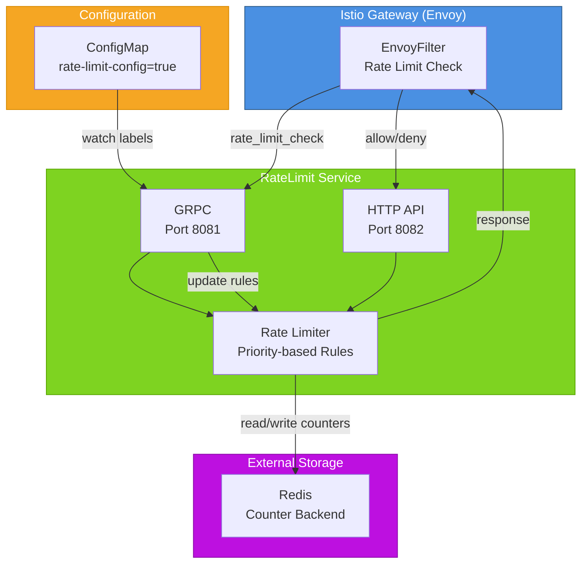

# RateLimit Service for Istio Gateway

RateLimit Service is a Kubernetes service that provides built-in rate limiting with dynamic configuration via ConfigMap and REST API.

## Features

- ✅ Built‑in rate limiter (no separate service required)
- ✅ Three algorithms: Fixed Window, Sliding Log
- ✅ Priority-based rule matching (highest priority rule applies first)
- ✅ Dynamic configuration via ConfigMap (auto‑reload)
- ✅ Management API for limits and statistics
- ✅ Prometheus metrics & Grafana dashboard
- ✅ Istio Gateway integration via EnvoyFilter
- ✅ Configurable key separator (e.g., `|`)
- ✅ Redis as a scalable counter backend
- ✅ User isolation with independent counters
- ✅ Rate limit reset API for individual users

## Architecture



## Installation
### Prerequisites
Kubernetes 1.24+
Istio 1.28+ with Gateway API enabled
Redis (optional but recommended for production)
Prometheus Operator (for metrics scraping)

### Helm Install
``` bash
# Clone the repository or add Helm repo
git clone https://github.com/Netcracker/qubership-core-bootstrap.git
cd qubership-core-bootstrap/ratelimit-service

# Install the service
helm install ratelimit-service ./helm/ratelimit-service \
  --namespace $NAMESPACE \
  --create-namespace \
  --set image.repository=ghcr.io/netcracker/ratelimit \
  --set image.tag=feat-ratelimit-snapshot

# Verify Installation
kubectl get pods -n $NAMESPACE -l app=ratelimit-service
kubectl get envoyfilter -n $NAMESPACE
```

## Configuration
Rate limiting rules are defined in ConfigMaps with the label rate-limit-config=true.

### Configuration example
```yaml
apiVersion: v1
kind: ConfigMap
metadata:
  name: ratelimit-config
  labels:
    rate-limit-config: "true"  # Required label for auto-discovery
    app: ratelimit-service
    version: v1
data:
  # Main configuration in YAML format
  config.yaml: |
    # Domain for rate limiting (used for grouping rules)
    # Different domains have separate counters
    domain: "rate_limit"
    
    # Separator for composite keys (default: "|")
    # Example: "path=/api|user_id=123"
    separator: "|"
    
    # List of rate limit rules (descriptors)
    # Rules are evaluated in priority order (highest priority first)
    descriptors:
      # ============================================
      # 1. DEFAULT RULE - Lowest priority
      # Catches all requests that don't match other rules
      # ============================================
      - key: ""                      # Empty key matches all requests
        rate_limit:
          unit: minute               # Time unit: second, minute, hour
          requests_per_unit: 60      # Number of requests per unit
        algorithm: "fixed_window"    # Algorithm: fixed_window, sliding_log
        priority: 0                  # 0 = lowest priority (catch-all)
        
      # ============================================
      # 2. PATH-SPECIFIC RULE - Medium priority
      # Applies to specific API endpoint
      # ============================================
      - key: "path"                  # Key to match against
        value: "/api/public"         # Exact value match
        rate_limit:
          unit: second
          requests_per_unit: 100
        algorithm: "fixed_window"
        priority: 50                 # Higher than default, lower than user rules
        
      # ============================================
      # 3. HIERARCHICAL RULES - Nested descriptors
      # Combines multiple conditions (path + user_id)
      # ============================================
      - key: "path"
        value: "/api/private"
        rate_limit:
          unit: second
          requests_per_unit: 10
        algorithm: "fixed_window"
        priority: 50                 # Base priority for this path
        descriptors:
          # Admin users - highest priority
          - key: "user_id"
            value: "admin"
            rate_limit:
              unit: minute
              requests_per_unit: 10000
            algorithm: "fixed_window"
            priority: 200            # Highest priority (unlimited access)
            
          # VIP users (regex pattern)
          - key: "user_id"
            value_regex: "^vip-.*"   # Regular expression match
            rate_limit:
              unit: minute
              requests_per_unit: 1000
            algorithm: "sliding_log" # More accurate but slightly slower
            priority: 100
            
          # Regular users
          - key: "user_id"
            value_regex: "^user-.*"
            rate_limit:
              unit: minute
              requests_per_unit: 30
            algorithm: "fixed_window"
            priority: 50
            
          # Anonymous/unknown users
          - key: "user_id"
            value_regex: "^guest-.*"
            rate_limit:
              unit: minute
              requests_per_unit: 10
            algorithm: "fixed_window"
            priority: 20
            
      # ============================================
      # 4. IP-BASED RULE - DDoS protection
      # Rate limit by source IP address
      # ============================================
      - key: "source_ip"
        rate_limit:
          unit: minute
          requests_per_unit: 100
        algorithm: "fixed_window"
        priority: 10
        
      # ============================================
      # 5. COMPOSITE KEY WITH MULTIPLE CONDITIONS
      # Complex scenario: path + user_id + client_ip
      # ============================================
      - key: "path"
        value: "/api/export"
        rate_limit:
          unit: hour
          requests_per_unit: 10
        algorithm: "fixed_window"
        priority: 50
        descriptors:
          # Per-user limit
          - key: "user_id"
            rate_limit:
              unit: hour
              requests_per_unit: 2
            algorithm: "fixed_window"
            priority: 100
          # Per-IP limit (additional restriction)
          - key: "client_ip"
            rate_limit:
              unit: minute
              requests_per_unit: 5
            algorithm: "sliding_log"
            priority: 80
            
      # ============================================
      # 6. HTTP METHOD SPECIFIC RULES
      # Different limits for GET, POST, DELETE, etc.
      # ============================================
      - key: "method"
        value: "POST"
        rate_limit:
          unit: second
          requests_per_unit: 20      # Stricter limit for POST requests
        algorithm: "fixed_window"
        priority: 30
        descriptors:
          - key: "path"
            value_regex: "^/api/.*"
            rate_limit:
              unit: minute
              requests_per_unit: 100
            algorithm: "sliding_log"
            priority: 40
            
      - key: "method"
        value: "GET"
        rate_limit:
          unit: second
          requests_per_unit: 200     # More permissive for GET
        algorithm: "fixed_window"
        priority: 20
        
      # ============================================
      # 7. SERVICE-TO-SERVICE (S2S) RULES
      # For internal service communication
      # ============================================
      - key: "service_name"
        value_regex: "^(auth|payment|notification)-service$"
        rate_limit:
          unit: second
          requests_per_unit: 500
        algorithm: "fixed_window"
        priority: 150                # High priority for internal services
        descriptors:
          - key: "environment"
            value: "production"
            rate_limit:
              unit: second
              requests_per_unit: 300
            algorithm: "sliding_log"
            priority: 160
          - key: "environment"
            value: "staging"
            rate_limit:
              unit: second
              requests_per_unit: 100
            algorithm: "fixed_window"
            priority: 140
            
      # ============================================
      # 8. GRAPHQL SPECIFIC RULES
      # Rate limit by operation type and complexity
      # ============================================
      - key: "graphql_operation"
        value: "mutation"
        rate_limit:
          unit: minute
          requests_per_unit: 50
        algorithm: "sliding_log"
        priority: 70
        descriptors:
          - key: "graphql_field"
            value_regex: "(export|delete|drop)"
            rate_limit:
              unit: hour
              requests_per_unit: 10
            algorithm: "fixed_window"
            priority: 90
            
      # ============================================
      # 9. TIER-BASED RULES (Freemium model)
      # Different limits based on subscription tier
      # ============================================
      - key: "subscription_tier"
        value: "free"
        rate_limit:
          unit: minute
          requests_per_unit: 10
        algorithm: "fixed_window"
        priority: 30
        
      - key: "subscription_tier"
        value: "pro"
        rate_limit:
          unit: minute
          requests_per_unit: 500
        algorithm: "sliding_log"
        priority: 80
        
      - key: "subscription_tier"
        value: "enterprise"
        rate_limit:
          unit: second
          requests_per_unit: 200
        algorithm: "fixed_window"
        priority: 150
        descriptors:
          - key: "organization_id"
            rate_limit:
              unit: minute
              requests_per_unit: 10000
            algorithm: "sliding_log"
            priority: 180
```

Alternative JSON configuration format
```json
  config.json: |
    {
      "domain": "rate_limit",
      "separator": "|",
      "descriptors": [
        {
          "key": "",
          "rate_limit": {
            "unit": "minute",
            "requests_per_unit": 60
          },
          "algorithm": "fixed_window",
          "priority": 0
        },
        {
          "key": "user_id",
          "value_regex": "^admin-.*",
          "rate_limit": {
            "unit": "minute",
            "requests_per_unit": 10000
          },
          "algorithm": "fixed_window",
          "priority": 200
        },
        {
          "key": "path",
          "value": "/api/export",
          "rate_limit": {
            "unit": "hour",
            "requests_per_unit": 10
          },
          "algorithm": "fixed_window",
          "priority": 50,
          "descriptors": [
            {
              "key": "user_id",
              "rate_limit": {
                "unit": "hour",
                "requests_per_unit": 2
              },
              "algorithm": "fixed_window",
              "priority": 100
            }
          ]
        }
      ]
    }
```
### Rule Structure Documentation
**Descriptor Fields**
| Field	| Type	| Required	| Description |
| ------ |--------- | ---------| ------------------- |
| key	| string	| Yes	| The key to match against (e.g., "path", "user_id", "source_ip")  |
| value	| string	| No	| Exact value to match (e.g., "/api/test")  |
| value_regex	| string	| No	| Regular expression pattern to match  |
| rate_limit	| object	| Yes	| Rate limit configuration  |
| algorithm	| string	| No	| Algorithm: "fixed_window" or "sliding_log" (default: "fixed_window")  |
| priority	| integer	| No	| Priority (0-200, default: 50). Higher = more important  |
| descriptors	| array	| No	| Nested rules for hierarchical matching |

**Rate Limit Unit**
| Unit	| Value	| Use Case |
| ------ |--------- | ------------------- |
| second	| 1 second	| High-frequency APIs, real-time systems | 
| minute	| 60 seconds | Standard API rate limiting | 
| hour	| 3600 seconds	| Batch operations, data export | 

**Algorithm Comparison**
| Algorithm	| Pros	| Cons	| Best For | 
| ------ |--------- | --------- | ------------------- |
| fixed_window	| Fast, low memory, simple	| Can allow bursts at window boundaries	| High throughput, non-critical APIs | 
| sliding_log	| Accurate, smooth rate limiting	| More memory, slightly slower	| Critical APIs, fair usage policies | 

**Priority Guidelines**
| Priority Range	| Use Case	| Example | 
| ------ |--------- | ------------------- |
| 200	| Critical/Admin access	| System admins, internal services | 
| 150-199	| Premium/Enterprise customers	| Paid tiers, SLAs | 
| 100-149	| Priority scenarios	| Authenticated users, mobile API | 
| 50-99	| Standard users	| Regular web users | 
| 10-49	| Restricted access	| Trial users, unauthenticated | 
| 1-9	| Fallback rules	| Default limits | 
| 0	| Lowest priority	| Global catch-all | 

Key Matching Logic
* Empty key ("") - Matches all requests (global fallback)
*Key with exact value - Matches when key=value
*Key with regex - Matches when key matches value_regex pattern
*Nested descriptors - ALL conditions must match (AND logic)

### Examples of Composite Keys
```yaml
# Simple key
key: "user_id"
value: "alice"

# Regex key
key: "user_id"
value_regex: "^vip-.*"

# Composite key (via separator)
# Results in: "path=/api|user_id=alice"
descriptors:
  - key: "path"
    value: "/api"
  - key: "user_id"
    value: "alice"
```

### Request Processing Flow
* Incoming request provides components (e.g., path=/api, user_id=alice)
* System builds composite key: path=/api|user_id=alice
* Finds all rules matching the key
* Selects rule with highest priority
* Applies rate limit from selected rule
* Returns 200 OK or 429 Too Many Requests

### Performance Considerations
Fixed Window: ~50ns per check, ~16 bytes per counter
Sliding Log: ~200ns per check, ~1KB per counter (depends on window size)
Priority matching: Rules are pre-sorted by priority at load time
Redis operations: Single INCR + EXPIRE per request


## API Endpoints
Operator exposes a REST API on port 8082.

| Method	| Endpoint	| Description | 
| ------ |--------- | ------------------- |
| GET	| /health	| Liveness check | 
| GET	| /ready	| Readiness check | 
| GET	| /metrics	| Prometheus metrics | 
| GET	| /api/v1/users/violating	| List users exceeding limits | 
| GET	| /api/v1/users/{user_id}/limits	| User limit details | 
| POST	| /api/v1/users/{user_id}/reset	| Reset user limits | 
| GET	| /api/v1/statistics	| Redis statistics | 
| GET	| /api/v1/ratelimit/rules	| List all rules | 
| POST	| /api/v1/ratelimit/rules	| Add a new rule | 
| DELETE	| /api/v1/ratelimit/rules/{name}	| Delete a rule | 
| POST	| /api/v1/ratelimit/check	| Check limit for components | 


### Example API Calls
```bash
# Get violating users
curl http://ratelimit-service:8082/api/v1/users/violating

# Reset limits for user 'alice'
curl -X POST http://ratelimit-service:8082/api/v1/users/alice/reset

# Add a rule with priority
curl -X POST http://ratelimit-service:8082/api/v1/ratelimit/rules \
  -H "Content-Type: application/json" \
  -d '{
    "name": "vip_rule",
    "pattern": ".*user_id=vip-.*",
    "limit": 1000,
    "window_sec": 60,
    "algorithm": "fixed_window",
    "priority": 100
  }'

# Check a rate limit
curl -X POST http://ratelimit-service:8082/api/v1/ratelimit/check \
  -H "Content-Type: application/json" \
  -d '{"components":{"path":"/test","user_id":"alice"}}'
```

## Monitoring
### Prometheus Metrics

| Metric | Type | Description |
|--------|------|-------------|
| ratelimit_violating_users_total | Gauge | Users exceeding limits |
| ratelimit_active_limits_total | Gauge | Active Redis keys |
| ratelimit_checks_total | Counter | Rate limit checks (label result) |
| ratelimit_requests_allowed_total	| Counter	| Allowed requests |
| ratelimit_requests_denied_total	| Counter	| Denied (rate limited) requests |
| ratelimit_resets_total | Counter | Limit resets |
| ratelimit_api_requests_total | Counter | API requests |
| ratelimit_redis_operations_total | Counter | Redis operations |
| ratelimit_config_reloads_total	| Counter	| ConfigMap reload events |

### Grafana Dashboard

The Helm chart includes a ready‑to‑use Grafana dashboard ConfigMap:

```bash
kubectl get configmap ratelimit-service-grafana-dashboard -n $NAMESPACE -o jsonpath='{.data.ratelimit-service\.json}' > dashboard.json
```

## Testing
### Unit Tests
```bash
# Run all unit tests
make test-unit

# Run specific package tests
go test -v ./pkg/ratelimit/...
go test -v ./pkg/api/...
go test -v ./pkg/metrics/...
```

### Integration Tests
```bash
# Run integration tests (requires Redis port-forward)
make test-integration-all

# Run E2E tests (operator API only)
make test-integration-e2e
```

### Load Testing
Using wrk
```bash
# Port‑forward Gateway
kubectl port-forward -n $NAMESPACE svc/public-gateway-istio 8080:8080 &

# Run test
wrk -t4 -c100 -d30s --header "x-user-id: test-user" \
  http://localhost:8080/test
```
Using k6
Create k6-script.js:

```javascript
import http from 'k6/http';
import { check, sleep } from 'k6';

export const options = {
  stages: [
    { duration: '30s', target: 20 },
    { duration: '1m', target: 20 },
    { duration: '10s', target: 0 },
  ],
  thresholds: {
    http_req_duration: ['p(95)<500'],
    http_req_failed: ['rate<0.05'],
  },
};

export default function () {
  const url = `http://${__ENV.GATEWAY_HOST}:${__ENV.GATEWAY_PORT}/test`;
  const headers = {
    'x-user-id': `user-${__VU}`,
  };
  const res = http.get(url, { headers });
  check(res, { 
    'status is 200 or 429': (r) => r.status === 200 || r.status === 429 
  });
  sleep(0.1);
}
```
Run:

```bash
kubectl port-forward -n $NAMESPACE svc/public-gateway-istio 8080:8080 &
GATEWAY_HOST=localhost GATEWAY_PORT=8080 k6 run k6-script.js
```

### Demo Tests
``` bash
# Run the interactive demo test suite
./run-demo-tests.sh

# Available tests:
# 1) Show Current Rules with Priorities
# 2) Add Rules with Different Priorities
# 3) Priority Demo (Admin/VIP/Normal Users)
# 4) Gateway Distribution Test
# 5) Rate Limit Accuracy Test
# 6) Algorithm Comparison Test
# 7) K6 Load Test
# 8) K6 Burst Test
```

## Troubleshooting
Rate limiting does not work
```bash
# Check EnvoyFilter
kubectl get envoyfilter -n $NAMESPACE

# Check operator logs
kubectl logs -n $NAMESPACE deployment/ratelimit-service

# Check active rules
curl http://ratelimit-service:8082/api/v1/ratelimit/rules

# Check Redis keys
kubectl exec -n $NAMESPACE deployment/redis -- redis-cli KEYS "*"

# Check specific user's rate limit
curl -X POST http://ratelimit-service:8082/api/v1/ratelimit/check \
  -H "Content-Type: application/json" \
  -d '{"components":{"path":"/test","user_id":"problem-user"}}'
```

Rule not matching
Check rule priorities - the rule with highest priority that matches will be applied:

```bash
# Verify rule priorities
curl http://ratelimit-service:8082/api/v1/ratelimit/rules | grep -E '"name"|"priority"'

# Test specific pattern matching
curl -X POST http://ratelimit-service:8082/api/v1/ratelimit/check \
  -H "Content-Type: application/json" \
  -d '{"components":{"path":"/test","user_id":"test-user"}}' | grep -E '"rule_name"|"limit"'
```

## High Latency
* Increase operator replicas: replicaCount: 3
* Use a high‑performance Redis instance
* Adjust resource limits in values.yaml
* Check Redis connection pool settings

#### Redis connection issues
```bash
# Test Redis connectivity from the operator pod
kubectl exec -n $NAMESPACE deployment/ratelimit -- \
  nc -zv redis.$NAMESPACE.svc.cluster.local 6379

# Check Redis stats
kubectl exec -n $NAMESPACE deployment/redis -- redis-cli INFO stats
```

## Makefile Targets

The project includes a Makefile with the following useful targets:

| Target | Description |
|--------|-------------|
| make test-unit | Run unit tests |
| make test-integration-all | Run integration tests (requires Redis port‑forward) |
| make test-integration-e2e | Run E2E tests (operator API only) |
| make test-cloud-e2e | Run cloud E2E tests (requires deployed service) |
| make test-all | Run all tests |