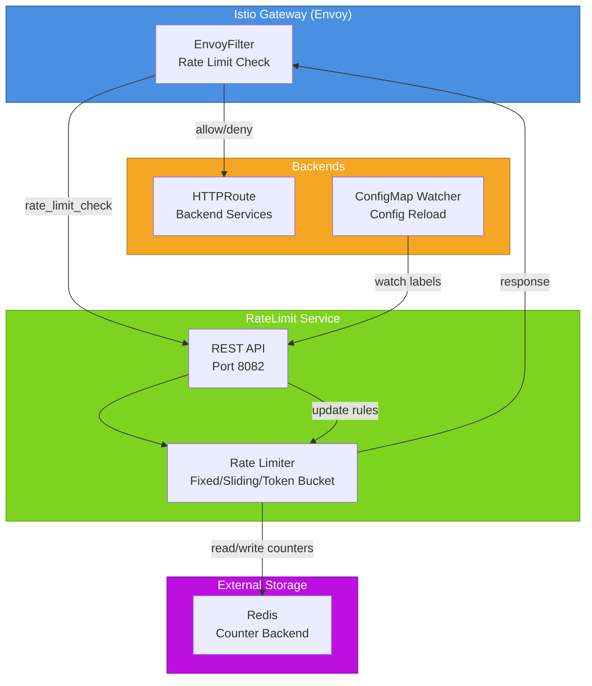

# RateLimit Service for Istio Gateway

RateLimit Service is a Kubernetes service that provides built-in rate limiting with dynamic configuration via ConfigMap and REST API.

## Features

- ✅ Built‑in rate limiter (no separate service required)
- ✅ Three algorithms: Fixed Window, Sliding Window, Token Bucket
- ✅ Dynamic configuration via ConfigMap (auto‑reload)
- ✅ Management API for limits and statistics
- ✅ Prometheus metrics & Grafana dashboard
- ✅ Istio Gateway integration via EnvoyFilter
- ✅ Configurable key separator (e.g., `|`)
- ✅ Redis as a scalable counter backend

## Architecture




## Installation

### Prerequisites

- Kubernetes 1.24+
- Istio 1.28+ with Gateway API enabled
- Redis (optional but recommended)
- Prometheus Operator (for metrics scraping)

### Helm Install

```bash
# Clone the repository or add Helm repo
git clone https://github.com/org/ratelimit-service.git
cd ratelimit-service

# Install the service
helm install ratelimit-service ./helm/ratelimit-service \
  --namespace $NAMESPACE \
  --create-namespace \
  --set image.repository=ghcr.io/netcracker/ratelimit \
  --set image.tag=feat-ratelimit-snapshot\

# Verify Installation
kubectl get pods -n $NAMESPACE -l app=ratelimit-service
kubectl get envoyfilter -n $NAMESPACE
```

## Configuration

Rate limiting rules are defined in ConfigMaps with the label rate-limit-config=true.

```yaml
apiVersion: v1
kind: ConfigMap
metadata:
  name: ratelimit-config
  labels:
    rate-limit-config: "true"
data:
  config.yaml: |
    domain: auth_limit
    separator: "|"
    descriptors:
      # Global limit for all requests
      - key: ""
        rate_limit:
          unit: minute
          requests_per_unit: 60
      # Path‑specific limit
      - key: path
        value: "/test"
        rate_limit:
          unit: second
          requests_per_unit: 5
        descriptors:
        - key: user_id
          rate_limit:
            unit: minute
            requests_per_unit: 2
```

### Production Scenarios

**Data Exfiltration Protection (Strict)**

```yaml
descriptors:
  - key: path
    value: "/api/export"
    rate_limit:
      unit: hour
      requests_per_unit: 10
    descriptors:
    - key: user_id
      rate_limit:
        unit: hour
        requests_per_unit: 2
```

**Public Endpoints (Permissive)**

```yaml
descriptors:
  - key: path
    value: "/api/public"
    rate_limit:
      unit: second
      requests_per_unit: 100
```

**IP‑based DDoS Protection**

```yaml
descriptors:
  - key: source_ip
    rate_limit:
      unit: minute
      requests_per_unit: 100
```
## API Endpoints

Operator exposes a REST API on port 8082.

| Method | Endpoint | Description |
|--------|----------|-------------|
| GET | /health | Liveness check |
| GET | /ready | Readiness check |
| GET | /metrics | Prometheus metrics |
| GET | /api/v1/users/violating | List users exceeding limits |
| GET | /api/v1/users/{user_id}/limits | User limit details |
| POST | /api/v1/users/{user_id}/reset | Reset user limits |
| GET | /api/v1/statistics | Redis statistics |
| POST | /api/v1/ratelimit/rules | Add a new rule |
| DELETE | /api/v1/ratelimit/rules/{name} | Delete a rule |
| POST | /api/v1/ratelimit/check | Check limit for components |

### Example API Calls
```bash
# Get violating users
curl http://ratelimit-service-api:8082/api/v1/users/violating

# Reset limits for user 'alice'
curl -X POST http://ratelimit-service-api:8082/api/v1/users/alice/reset

# Check a rate limit
curl -X POST http://ratelimit-service-api:8082/api/v1/ratelimit/check \
  -H "Content-Type: application/json" \
  -d '{"components":{"path":"/test","user_id":"alice"}}'
```

## Monitoring

### Prometheus Metrics

| Metric | Type | Description |
|--------|------|-------------|
| ratelimit_violating_users_total | Gauge | Users exceeding limits |
| ratelimit_active_limits_total | Gauge | Active Redis keys |
| ratelimit_checks_total | Counter | Rate limit checks (label result) |
| ratelimit_resets_total | Counter | Limit resets |
| ratelimit_api_requests_total | Counter | API requests |
| ratelimit_redis_operations_total | Counter | Redis operations |

### Grafana Dashboard

The Helm chart includes a ready‑to‑use Grafana dashboard ConfigMap:

```bash
kubectl get configmap ratelimit-service-grafana-dashboard -n $NAMESPACE -o jsonpath='{.data.ratelimit-service\.json}' > dashboard.json
```
## Load Testing
### Using wrk

```bash
# Port‑forward Gateway
kubectl port-forward -n $NAMESPACE svc/public-gateway-istio 8080:8080 &

# Run test
wrk -t4 -c100 -d30s --header "Authorization: Bearer $TOKEN" \
  http://localhost:8080/test
```
### Using k6

Create k6-script.js:

```javascript
import http from 'k6/http';
import { check, sleep } from 'k6';

export const options = {
  stages: [
    { duration: '30s', target: 20 },
    { duration: '1m', target: 20 },
    { duration: '10s', target: 0 },
  ],
  thresholds: {
    http_req_duration: ['p(95)<500'],
    http_req_failed: ['rate<0.01'],
  },
};

export default function () {
  const url = `http://${__ENV.GATEWAY_HOST}:${__ENV.GATEWAY_PORT}/test`;
  const headers = {
    'Authorization': `Bearer ${__ENV.JWT_TOKEN}`,
    'x-user-id': 'load-user',
  };
  const res = http.get(url, { headers });
  check(res, { 'status is 200 or 429': (r) => r.status === 200 || r.status === 429 });
  sleep(0.1);
}
```
Run:

```bash
kubectl port-forward -n $NAMESPACE svc/public-gateway-istio 8080:8080 &
GATEWAY_HOST=localhost GATEWAY_PORT=8080 JWT_TOKEN=$(cat token.txt) k6 run k6-script.js
```
### Running Load Tests in the Cloud

Use k6-operator:

```bash
kubectl apply -f https://raw.githubusercontent.com/grafana/k6-operator/main/config/crd/bases/k6.io_k6s.yaml

kubectl run load-test --image=loadimpact/k6 --restart=Never \
  --env=GATEWAY_HOST=public-gateway-istio \
  --env=GATEWAY_PORT=8080 \
  --env=JWT_TOKEN=$(kubectl get secret e2e-jwt-token -o jsonpath='{.data.token}' | base64 -d) \
  -- /bin/sh -c "k6 run - < test/load/k6-script.js"
```
## Troubleshooting

### Rate limiting does not work
```bash
# Check EnvoyFilter
kubectl get envoyfilter -n $NAMESPACE

# Check operator logs
kubectl logs -n $NAMESPACE deployment/ratelimit-service

# Check Redis keys
kubectl exec -n $NAMESPACE deployment/redis -- redis-cli KEYS "*"
```

### High Latency

Increase operator replicas (replicaCount: 3)

Use a high‑performance Redis instance

Adjust resource limits

## Makefile Targets

The project includes a Makefile with the following useful targets:

| Target | Description |
|--------|-------------|
| make test-unit | Run unit tests |
| make test-integration-all | Run integration tests (requires Redis port‑forward) |
| make test-integration-e2e | Run E2E tests (operator API only) |
| make test-cloud-e2e | Run cloud E2E tests (requires deployed operator) |
| make test-load | Run load tests (requires Gateway port‑forward) |
| make test-all | Run all tests |
| make deploy | Deploy to cloud using Helm |
| make undeploy | Uninstall from cloud |
| make docker-build | Build Docker image |
| make docker-push | Push image to registry |